<p align="center">
  
</p>

<p align="center">
  <em>A full-stack booking platform for a network of fantasy dungeon-raid experiences —<br/>designed, planned, and built end-to-end as a portfolio project.</em>
</p>

<p align="center">
  
  
  
  
  
  
  
</p>

---

> **There's no live deployment** — this is a portfolio build, so the GIFs and screenshots below *are* the demo. Everything shown runs against a fully seeded local database with three role-based portals.

QuestReserve is a reservation platform built for **WizardsTowerCorp**, a company that manages a network of independently-owned dungeons and coordinates the adventuring parties who book raids in them. It's a real-shaped SaaS problem — multi-tenant providers, role-based access, availability that can't double-book, reviews, messaging, an admin back office — dressed up in a world of caves, crypts, and questionable life choices.

I built it the way I'd build production software: **spec first, then a phased roadmap, then tickets, then tests.** The fantasy theming is the fun part; the discipline underneath is the point.

---

## The Premise

Dungeon owners struggle with scheduling. Adventuring parties struggle with finding a raid that matches their appetite for danger. The regional wizard tower, tired of the chaos (and the occasional TPK-related paperwork), commissions a single platform to bring order to it all.

The seed data leans all the way in — you'll book raids in **Moria**, **Ravenloft**, and **Stormveil Castle**, run by providers like **Smaug** and **Dracula**, for parties led by **Geralt of Rivia** and **Laios Touden**. It makes the app genuinely fun to click around.

---

## What It Does

QuestReserve is three tailored experiences on one platform. Each role sees only what's relevant to it.

### For Adventurers — browse, discover, book

The customer portal is a split-view browser: a scannable list on the left, a rich image gallery on the right.

<p align="center">
  <a href="assets/readmePics/3.jpg" target="_blank">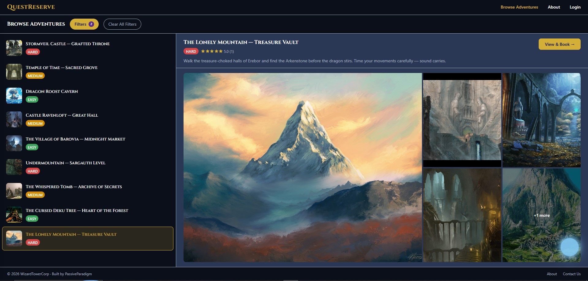</a>
</p>

**Meet Will — the natural-language quest finder.** Instead of fiddling with filter checkboxes, just *tell Will what you want*. Type "something spooky underground" or "an easy adventure for beginners" and Will translates your words into structured filters and reshapes the results in real time.

<p align="center">
  <a href="assets/readmePics/1.gif" target="_blank">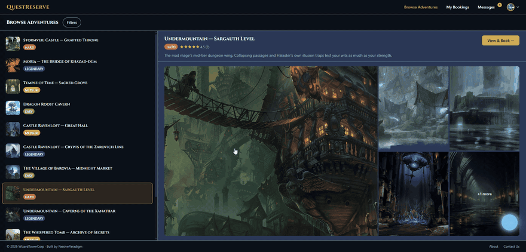</a>
</p>

> <sub>Under the hood, Will is a client-side matcher that maps natural-language keywords to the same structured filter model the manual filter panel uses — no black box, no external API call. It's a fun front-end for a genuinely deep filtering system.</sub>

Prefer the controls? The full filter panel supports multi-select difficulty and tone, party size, level range, run time, setting, landscape, and a puzzle-vs-combat focus scale.

<p align="center">
  <a href="assets/readmePics/5.jpg" target="_blank">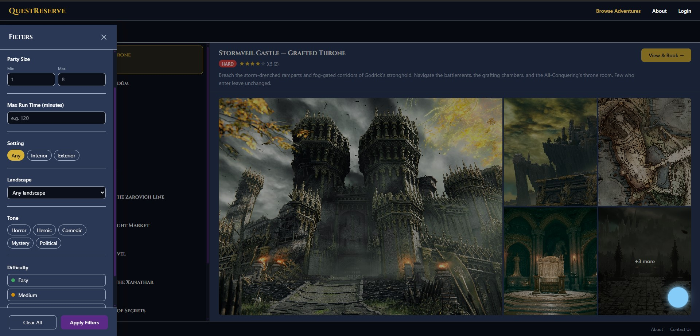</a>
  <a href="assets/readmePics/4.jpg" target="_blank">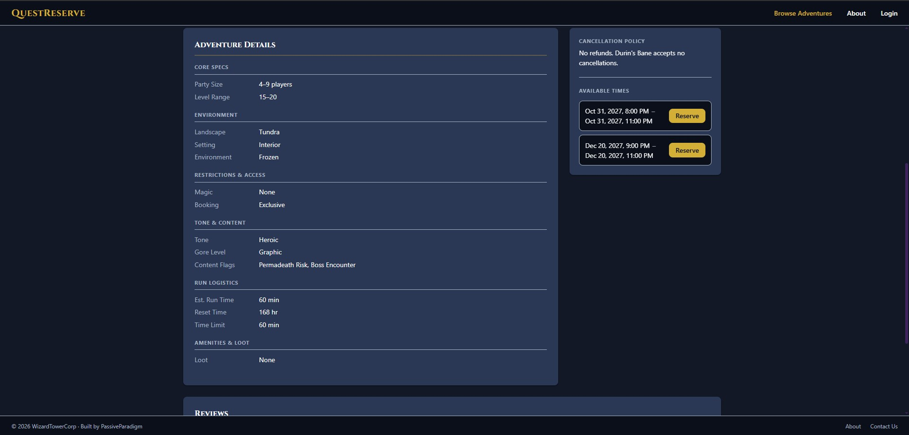</a>
</p>

Every location has a full detail page — ratings, its complete ruleset, and a gallery of the dungeon itself.

<p align="center">
  <a href="assets/readmePics/11.gif" target="_blank">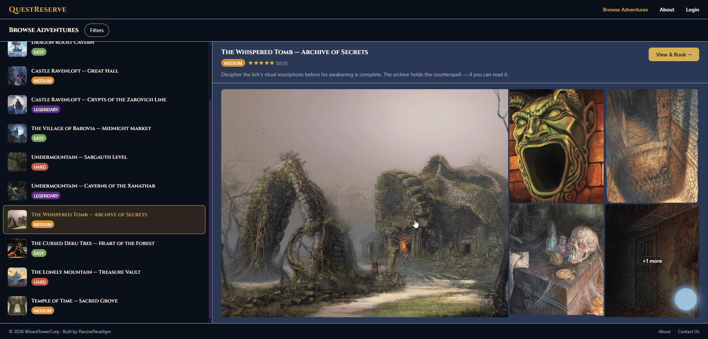</a>
</p>

Booking a time slot is a clean, guarded flow that can't double-book…

<p align="center">
  <a href="assets/readmePics/2.gif" target="_blank">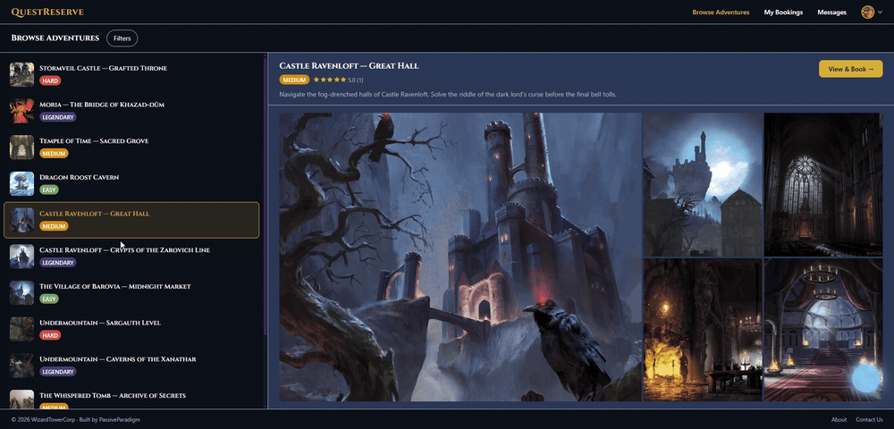</a>
</p>

…and after a raid, parties and providers can review each other and the location.

<p align="center">
  <a href="assets/readmePics/10.gif" target="_blank">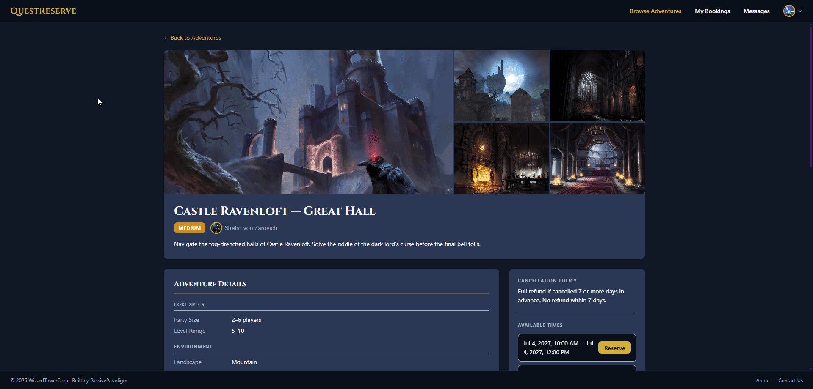</a>
</p>

### For Providers — run your dungeon

Dungeon owners get a dashboard to manage their listings, availability, and bookings.

<p align="center">
  <a href="assets/readmePics/6.jpg" target="_blank"></a>
</p>

Creating a location means filling out that deep ruleset — party limits, level range, tone, gore level, the puzzle↔combat slider, permission flags, loot tables, and more. This is where the domain modeling shows.

<p align="center">
  <a href="assets/readmePics/7.gif" target="_blank">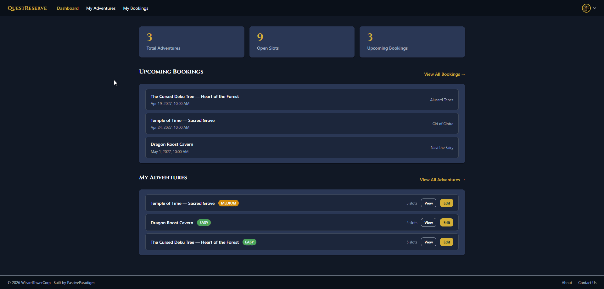</a>
</p>

### For Platform Admins — oversee the network

WizardsTowerCorp staff get a back office to manage providers, monitor platform-wide activity, and administer users — with role-gated capabilities (only a `SUPERUSER` can onboard new admins).

<p align="center">
  <a href="assets/readmePics/8.jpg" target="_blank">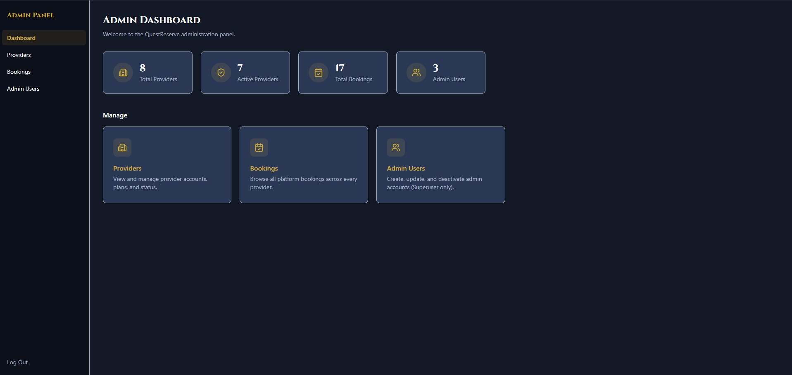</a>
</p>

The provider and booking tables support live column sorting and search.

<p align="center">
  <a href="assets/readmePics/9.gif" target="_blank">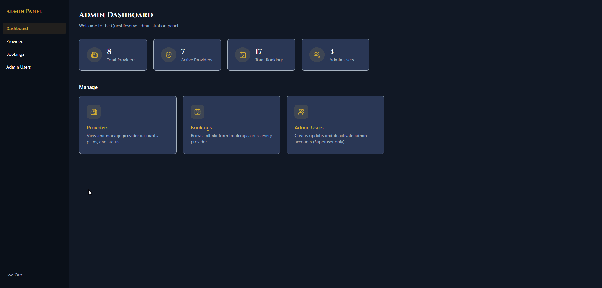</a>
</p>

### Messaging across roles

Providers and customers can hold threaded conversations tied to their bookings.

<p align="center">
  <a href="assets/readmePics/13.jpg" target="_blank">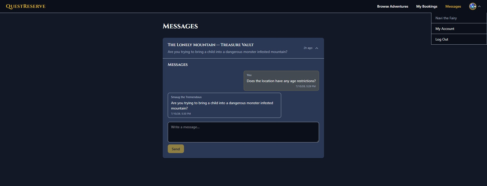</a>
</p>

---

## Architecture

QuestReserve is a **modular monolith** with strict layering. The rule is simple and enforced everywhere: controllers do HTTP, services do business logic, repositories do data — no layer reaches past its neighbor.

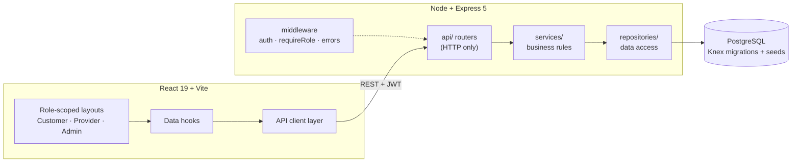

**Backend** — Node.js · Express 5 · TypeScript · Knex · PostgreSQL · JWT
`api / services / repositories / infrastructure / middleware / utils`. A generic `BaseRepository<T>` gives every entity consistent data access. Auth is JWT + role middleware; tenants are isolated by `provider_id`.

**Frontend** — React 19 · TypeScript · Vite · Tailwind v4 · React Router 7
`api / components / contexts / hooks / layouts / pages / routes / utils`. Three role-scoped layouts, API calls isolated in `/api`, data fetching isolated in `/hooks`, forms validated with React Hook Form + Zod.

**Database** — PostgreSQL, versioned with Knex migrations and reproducible seed data.

---

## How It Was Built

This is the part I'm proudest of. QuestReserve wasn't vibes — it was planned like a real product and delivered in disciplined increments.

| Artifact | Where | What it is |
|---|---|---|
| **Project spec** | [`spec/PROJECT_SPEC.md`](spec/PROJECT_SPEC.md) | Vision, domain model, roles, constraints, and explicit non-goals — decided up front |
| **Phased roadmap** | [`docs/planning/mvp-implementation-phases.md`](docs/planning/mvp-implementation-phases.md) | The full delivery sequence, Phase 1 → 12 |
| **Phase & ticket plans** | [`docs/planning/`](docs/planning/) | ~20 detailed phase plans and ~20 ticket plans that fed a ticket-creation pipeline |
| **User stories & DoD** | [`docs/`](docs/) | Role-based stories and a written Definition of Done |
| **Code reviews** | [`docs/reviews/`](docs/reviews/) | Recorded review passes with findings applied |

Work shipped in **12 phases**, from the database foundation through auth, the provider/customer/admin domains, a frontend scaffold, and feature layers (booking flow, guest access, filtering, reviews, the expanded ruleset, Will, and the admin panel). Each phase built on a stable, reviewed base rather than a big-bang merge.

**Testing** — the backend carries unit + integration tests that run against a live throwaway PostgreSQL database, auto-migrating and rolling back around each run, with isolated per-test data so suites stay parallel-safe. Integration tests cover the full booking workflow and ownership enforcement.

---

## Domain Model Spotlight

Most booking apps model a "listing" with a handful of fields. QuestReserve's `BookingLocation` is deliberately rich, because a dungeon raid has *opinions*:

- **Party & difficulty** — party size limits, level range, `EASY → LEGENDARY` difficulty
- **Flavor** — landscape type, setting, tone tags (horror, heroic, comedic, mystery, political), gore level
- **A puzzle-vs-combat scale** — a signed integer from `−5` (pure puzzle) to `+5` (pure combat), fully filterable
- **Restrictions & permissions** — magic/class/race/faction limits, mount/familiar/solo flags
- **Content flags** — permadeath, PvP, boss encounters, non-lethal, scouting
- **Logistics & loot** — run/reset/time-limit minutes, amenities, loot type, unique-item chance

This is the backbone of both Will and the manual filters — the depth is what makes discovery interesting.

---

## Run It Locally

QuestReserve is a monorepo with two apps. Each has its own setup guide:

- **Backend** → [`questreserve-backend/README.md`](questreserve-backend/README.md) — full install, DB setup, migrations, seed accounts, test suite, and API overview
- **Frontend** → [`questreserve-frontend/README.md`](questreserve-frontend/README.md)

The seed script creates a full cast of admins, providers, and adventurers (all with password `Password1!`) so you can log into any of the three portals immediately. See the [backend README](questreserve-backend/README.md#seed-accounts) for the account list.

```
questreserve/
├── questreserve-backend/    Node + Express 5 + Knex API
├── questreserve-frontend/   React 19 + Vite SPA
├── spec/                    Project specification
├── docs/                    Planning docs, user stories, reviews, API contract
└── assets/                  Branding + demo imagery
```

---

## Roadmap

The MVP is complete. Intentionally deferred (schema and seams already considered in the spec):

- Payment processing, refunds, and provider revenue dashboards
- Geographic / location-based filtering
- Advanced analytics (booking trends, occupancy) and admin global configuration
- Dynamic ruleset variants for seasonal or special events
- Audit logs for critical actions

---

<p align="center"><sub>Built end-to-end — spec to seed data — by someone who takes boring infrastructure seriously and dungeon lore even more so.</sub></p>
